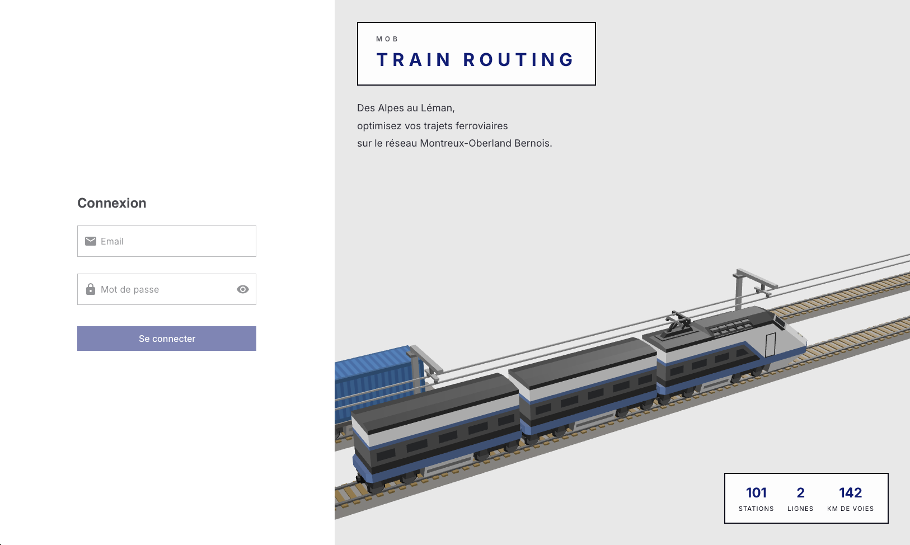
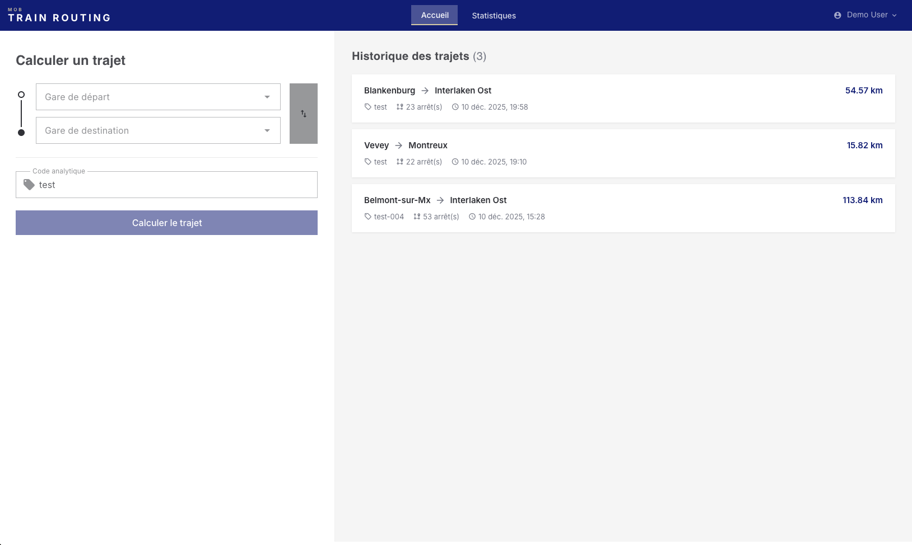
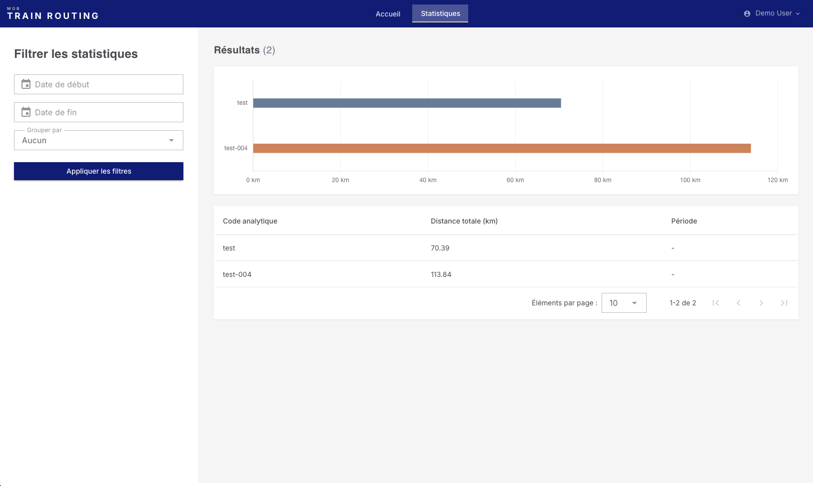

# MOB Train Routing

Application de calcul d'itinéraires ferroviaires pour le réseau MOB (Montreux Oberland Bernois).

[](https://github.com/leo-rnl/mob-train-routing/actions/workflows/ci.yml)

---

## Démarrage rapide

```bash
git clone https://github.com/leo-rnl/mob-train-routing.git
cd mob-train-routing
make dev
```

L'application est accessible sur :
- **Frontend** : http://localhost:3000
- **API** : http://localhost:8000

> Pour le déploiement production avec HTTPS : `make prod` (voir [Déploiement](#déploiement)).

**Compte de démonstration** :
```
Email : demo@mob.ch
Mot de passe : password
```

---

## Aperçu

### Fonctionnalités

- Calcul d'itinéraires via l'algorithme de Dijkstra
- Historique des trajets par utilisateur
- Statistiques agrégées par code analytique
- Authentification sécurisée (cookie session + Bearer token)

### Captures d'écran

| Login | Calcul de trajet | Statistiques |
|-------|------------------|--------------|
|  |  |  |

---

## Stack technique

| Composant | Technologies |
|-----------|--------------|
| **Backend** | PHP 8.4, Laravel 12, Sanctum |
| **Frontend** | TypeScript 5, Vue 3, Vuetify 3, Pinia |
| **Base de données** | PostgreSQL 16 |
| **Infrastructure** | Docker, GitHub Actions |

### Structure du projet

```
mob-train-routing/
├── .claude/                 # Documentation workflow
├── CLAUDE.md                # Spécifications et contexte
├── backend/                 # API Laravel
│   ├── app/
│   │   ├── Http/Controllers/Api/
│   │   ├── Models/
│   │   └── Services/        # GraphService (Dijkstra)
│   ├── database/data/       # stations.json, distances.json
│   └── tests/
├── frontend/                # Application Vue.js
│   ├── src/
│   │   ├── components/
│   │   ├── views/
│   │   ├── stores/          # Pinia
│   │   └── services/        # Client API
│   └── tests/
└── docker-compose.yml
```

### Réseau ferroviaire

Le graphe couvre deux lignes interconnectées via la station Chamby (CABY) :
- **Ligne MOB** : Montreux → Zweisimmen (avec branches vers Lenk et Interlaken Ost)
- **Ligne MVR-ce** : Vevey → Les Pléiades

Données : 101 stations, 84 segments, ~142 km de voies.

> Note : Le total diffère des 75.3 km officiels car le JSON fourni inclut les branches secondaires et la ligne Zweisimmen-Interlaken.

---

## API

| Méthode | Endpoint | Description |
|---------|----------|-------------|
| POST | `/api/v1/auth/token` | Obtenir un Bearer token |
| GET | `/api/v1/stations` | Liste des stations |
| POST | `/api/v1/routes` | Calculer un itinéraire |
| GET | `/api/v1/routes` | Historique utilisateur |
| GET | `/api/v1/stats/distances` | Statistiques agrégées |

### Exemple

```bash
# Authentification
curl -X POST http://localhost:8000/api/v1/auth/token \
  -H "Content-Type: application/json" \
  -d '{"email": "demo@mob.ch", "password": "password", "device_name": "cli"}'

# Calcul de trajet
curl -X POST http://localhost:8000/api/v1/routes \
  -H "Authorization: Bearer <token>" \
  -H "Content-Type: application/json" \
  -d '{"fromStationId": "MX", "toStationId": "ZW", "analyticCode": "PASSENGER-001"}'
```

---

## Décisions & Contexte

### Laravel

Le brief mentionne Symfony et CakePHP. J'ai choisi Laravel car il s'appuie sur de nombreux composants Symfony (HttpFoundation, Console, Routing) et partage les mêmes patterns (Services, FormRequest). Les deux frameworks sont proches dans leur philosophie.

### Vuetify

Vuetify 3 est mentionné dans la stack MOB. Je ne l'utilise pas habituellement, c'était l'occasion de m'y familiariser tout en collant aux outils de l'équipe.

### Authentification

Double mode via Sanctum :
- **Cookie httpOnly** pour le frontend (limite l'exposition aux attaques XSS)
- **Bearer token** via `/api/v1/auth/token` pour la conformité OpenAPI

### PostgreSQL

Choisi pour sa cohérence avec la stack MOB et son support natif des UUID.

### Dijkstra

Implémenté dans `GraphService` car la spec OpenAPI exige le champ `path` avec la liste des stations traversées.

### Messages d'erreur

Les messages d'erreur de l'API sont en français pour rester cohérents avec l'interface utilisateur. Sur un projet à plus grande échelle, une solution i18n aurait été plus pertinente.

### Extensions

Quelques fonctionnalités ajoutées au-delà de la spec :

| Extension | Raison |
|-----------|--------|
| `GET /stations` | Nécessaire pour l'autocomplétion et l'affichage des noms complets |
| `GET /routes` | Historique des trajets par utilisateur |
| Scène 3D (login) | Enrichir l'onboarding avec deux trains circulant sur deux lignes |
| Trajets liés au user | Permet l'historique personnel et le bouton "Réutiliser" |

### Hypothèses

| Hypothèse | Justification |
|-----------|---------------|
| Graphe bidirectionnel | Un train circule dans les deux sens |
| Code analytique libre | Aucune table de référence fournie |
| Stations hors graphe → 422 | Si absente de `distances.json` |

---

## Qualité

### Tests

| Suite | Nombre | Coverage |
|-------|--------|----------|
| Backend (PHPUnit) | 63 tests | > 80% |
| Frontend (Vitest) | 105 tests | > 80% |

### Analyse statique

- **Backend** : PHPStan niveau 6, PSR-12 (PHPCS)
- **Frontend** : ESLint, TypeScript strict

### CI/CD

Pipeline GitHub Actions :
1. Lint (PHPCS, PHPStan, ESLint, TypeScript)
2. Tests avec coverage
3. Audit de sécurité (Composer, npm)
4. Build des images Docker
5. Scan de vulnérabilités (Trivy)
6. Test DAST (OWASP ZAP)

> **Note DAST** : Le scan ZAP remonte des warnings sur des headers de hardening avancés (CSP, HSTS preload, etc.) que j'ai estimé hors scope de ce test technique.

---

## Accessibilité

Dans le secteur du transport, l'accessibilité numérique est un enjeu courant. J'ai visé les critères **WCAG 2.1 niveau AA** :

- Navigation clavier (Tab, Enter, Escape)
- Focus visible
- Labels ARIA
- Contrastes conformes (minimum 4.5:1)
- Messages d'erreur annoncés aux lecteurs d'écran
- Skip links

---

## Développement

### Prérequis

- Docker Desktop
- Docker Compose v2+
- Make (préinstallé sur macOS/Linux)

### Commandes Make

| Commande | Description |
|----------|-------------|
| `make dev` | Démarrer l'environnement de développement |
| `make prod` | Démarrer la production avec HTTPS |
| `make down` | Arrêter tous les containers |
| `make logs` | Voir les logs (filtrer avec `SERVICE=backend`) |
| `make clean` | Supprimer containers et volumes |

### Commandes qualité

**Backend** :
```bash
composer phpcs          # Lint PSR-12
composer phpstan        # Analyse statique
php artisan test        # Tests
```

**Frontend** :
```bash
npm run lint            # ESLint + Prettier
npm run type-check      # TypeScript
npm run test            # Vitest
```

**Debug 3D** (dev uniquement) : http://localhost:3000/login#debug

---

## Déploiement

### Production avec HTTPS (Traefik)

Le déploiement production utilise **Traefik** comme reverse proxy avec terminaison TLS.

```bash
make prod
```

Cette commande :
1. Génère les certificats self-signed (si absents)
2. Crée le fichier `.env` depuis `.env.example` (si absent)
3. Démarre le stack production

L'application est accessible sur :
- **Frontend** : https://localhost
- **API** : https://localhost/api/v1
- **Dashboard Traefik** : http://localhost:8080 (désactiver en production réelle)

> **Note** : Le navigateur affichera un avertissement pour le certificat self-signed. Acceptez-le ou ajoutez le certificat au truststore système.

<details>
<summary>Ajouter le certificat au truststore (optionnel)</summary>

**macOS** :
```bash
sudo security add-trusted-cert -d -r trustRoot \
  -k /Library/Keychains/System.keychain \
  traefik/certs/localhost.crt
```

**Linux (Ubuntu/Debian)** :
```bash
sudo cp traefik/certs/localhost.crt /usr/local/share/ca-certificates/mob-localhost.crt
sudo update-ca-certificates
```
</details>

### Images GHCR

```bash
docker pull ghcr.io/leo-rnl/mob-train-routing-backend:latest
docker pull ghcr.io/leo-rnl/mob-train-routing-frontend:latest
```

### Variables requises

| Variable | Description |
|----------|-------------|
| `APP_KEY` | Clé Laravel (générer avec `php artisan key:generate --show`) |
| `POSTGRES_PASSWORD` | Mot de passe PostgreSQL |
| `APP_URL` | URL publique (`https://localhost` par défaut) |

---

## Pour aller plus loin

### Pistes d'amélioration

- **Performance** : Cache Redis pour le graphe Dijkstra
- **Données** : Table de référence pour les codes analytiques
- **Statistiques** : Métriques enrichies par code analytique (distance moyenne, nombre de trajets, nombre moyen de stations traversées) avec filtrage par utilisateur
- **Onboarding** : Sur la scène 3D du login, afficher un tag analytique fictif sur chaque train avec un kilométrage qui s'incrémente — une façon passive d'illustrer le métier de l'application, pertinente pour des utilisateurs métier (gestionnaires de trafic, analystes)

### Documentation

- [CLAUDE.md](CLAUDE.md) - Spécifications et workflow
- [.claude/workflow.md](.claude/workflow.md) - Conventions de développement

---

Projet réalisé dans le cadre du défi technique MOB.
